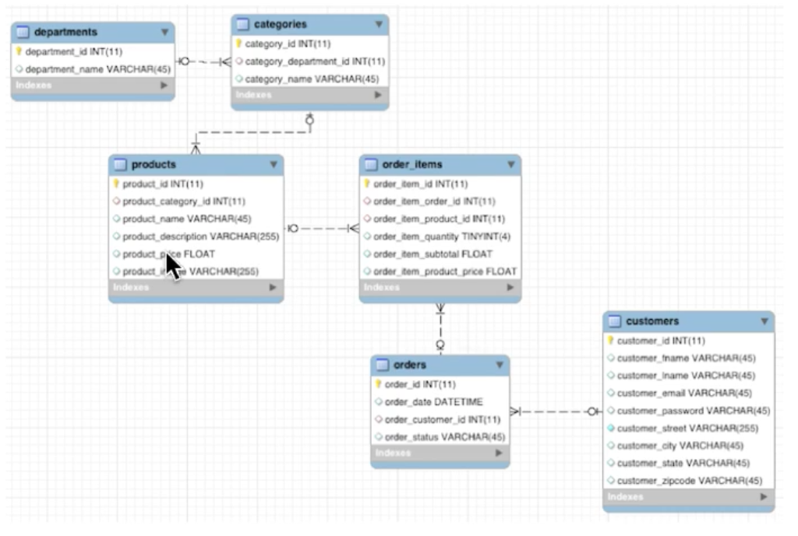

# Dataset Description
The dataset is [here](https://github.com/dgadiraju/data).
To practice it is recommended to use Cloudera and Sandbox.
To use the files is necessary to clone the repository inside of the Virtual Machines
and for it is necessary to setup the git inside of the environment.

Database Description:

- Master Tables:
  - customers ;
  - products ;
  - categories ;
  - departments

- Transaction Tables
  - orders;
  - order_items

In order to get the number of records of each table:

    wc -l /data/retail_db/* /*

- One departament can have many categories;
- Once category can have many products;
- One product can have many order_items;
- One order can have many order_items;
- One customer can have many orders.
